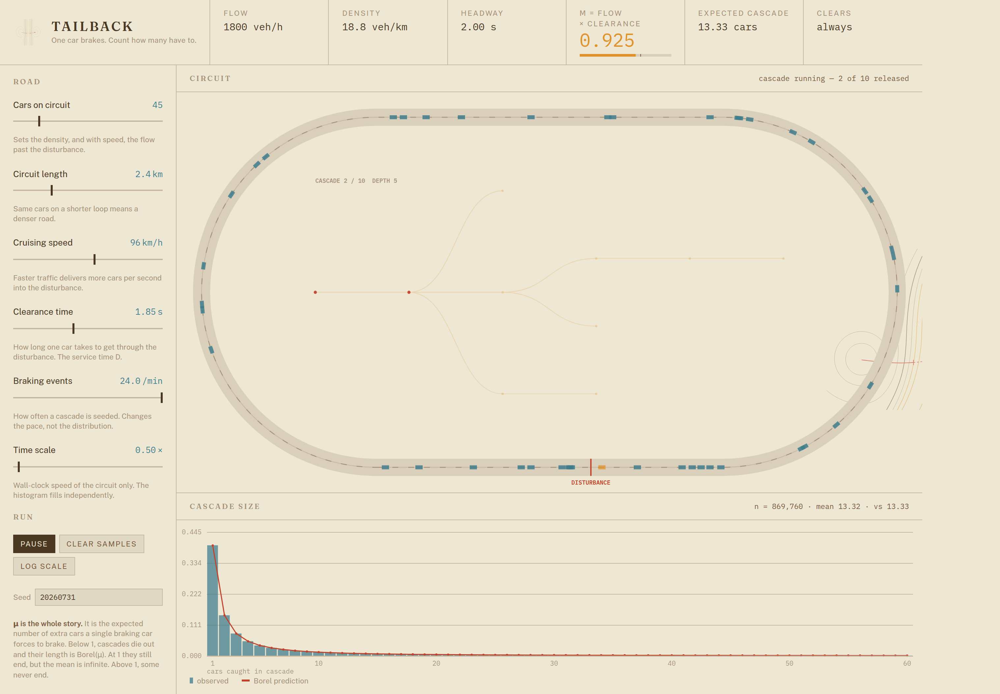

# Tailback

One car brakes on a closed circuit. Some cars behind it have to brake too, and
some behind those, and so on until the disturbance dies out. The number of cars
caught in a single cascade follows a **Borel distribution**, and this is an
interactive demonstration of that.



The whole thing hangs on one number:

```
density  k = cars / circuit length
flow     q = k × speed
mu       μ = q × clearance time
```

$\mu$ is the expected number of extra cars a single braking car forces to brake.
Below 1, cascades die out and their size is $\text{Borel}(\mu)$ with mean
$1/(1-\mu)$. At exactly 1 they still end, but the mean is infinite. Above 1, some
jams never clear at all — which is what the traffic you actually sit in looks
like.

The sliders are the four things that move $\mu$: how many cars, how long the
loop, how fast they go, and how long each one takes to get through the
disturbance. Push any of them and watch the fit hold, the tail thicken, and the
capacity meter approach the mark.

## What's on screen

The **circuit** shows cars flowing, a fixed disturbance point, and the tailback
queued behind it. Inside the loop it draws the Galton–Watson tree of the cascade
currently running: one node per car caught, in amber until that car is released
and red afterwards. The tree is the reason the count is Borel, so it seemed
worth drawing rather than describing.

The **histogram** compares observed cascade sizes against the Borel prediction.
It fills at roughly 20,000 samples a second, so agreement is visible in a couple
of seconds. Above criticality the bars cover only the cascades that cleared, and
the curve automatically switches to the correct conditional law.

The **gantry** across the top carries the derived quantities, with $\mu$ against
its critical value of 1.

## Running it

No build step, no dependencies. It is ES modules and canvas, so it needs to be
served rather than opened from the filesystem:

```bash
python3 -m http.server 8000   # or: npx serve
```

Then open <http://localhost:8000>.

Tests cover the distribution code, not the rendering:

```bash
node test/smoke.mjs
```

They check the PMF against hand-enumerated trees for $n \le 3$, that it sums to
1 and reproduces both moments below criticality, that it sums to the extinction
probability above it, that the log-space form survives $n = 5000$, and that the
simulator's empirical law matches the closed form.

## Deploying

Settings → Pages → deploy from branch, root directory. `.nojekyll` is present so
the asset paths are served untouched. Nothing else is needed.

The page pulls the house style — the palette, the three typefaces and the
signature figure — from the shared Tunnel assets on jsDelivr at runtime, so it
needs outbound network access to `cdn.jsdelivr.net` and `fonts.googleapis.com`.
Offline it still runs and stays legible; it falls back to system fonts and the
canvases lose their colours, since those are read from the linked custom
properties.

## Layout

```
index.html          markup: gantry, control rail, two canvas panels; links the
                    shared Tunnel tokens.css and tunnel-figure.js from the CDN
css/tokens.css      the house palette mapped onto road semantics — the only
                    file with colours in it
css/app.css         layout and components
js/borel.js         PMF in log space, moments, extinction probability
js/rng.js           seeded RNG, Poisson sampler
js/queue.js         M/D/1 busy period: fast counter and tree-building variants
js/model.js         slider spec, and the traffic parameters → μ mapping
js/controls.js      builds the rail from the spec
js/circuit.js       stadium geometry, cars, tailback, cascade tree
js/chart.js         histogram with the Borel overlay
test/smoke.mjs      distribution and simulator checks
MODEL.md            the derivation and the modelling assumptions
```

The maths is separated from the rendering deliberately: `borel.js`, `queue.js`,
`rng.js` and `model.js` have no DOM dependency and are directly testable in Node.

## Restyling

The page wears the in-house **Tunnel** style. Its locked layer — the exact
palette and the Fraunces / Public Sans / IBM Plex Mono type — is linked from the
one hosted copy rather than vendored here, so a change upstream reaches this
page. Nothing in this repo hard-codes a hex.

`css/tokens.css` is the whole reskin surface: it says what each identity colour
*means* on a road, deriving every value from the linked set.

```
contour tints   the carriageway and its markings
incident teal   traffic still moving, and the observed distribution
amber           a scalar field running high — mu near capacity, cars recovering
route red       the cascade, and the Borel law drawn through it
```

Canvas drawing reads those same custom properties through `getComputedStyle`,
fonts included, so editing that one file reskins the DOM and both canvases
together.

## Where to take it

**Make the circuit produce the statistic, rather than stage it.** Right now the
histogram comes from an exact M/D/1 sampler and the circuit renders a draw from
it. Replacing that with genuine car-following — cars stop when they reach the
back of the queue, and *their* arrivals drive the branching — is the most
interesting extension, because on a closed loop with no overtaking the arrival
process is not Poisson. The realised distribution should track Borel at low
density and depart from it as the loop fills. Plotting both empirical laws
against the theory would make the departure the point of the piece.

**Multiple lanes**, so a braking car can trigger sympathetic braking sideways as
well as behind, and the offspring distribution stops being a chain.

**Borel–Tanner**, seeding a cascade with $k$ simultaneous brakers. The PMF is
already implemented in `borel.js` and unused; it needs a slider and a change to
the tree sampler's root.

**Duration as well as size.** A busy period of $N$ cars lasts $ND$ seconds, so the
time distribution is a rescaled Borel. Worth a second chart, since delay is what
a driver actually experiences.

**Goodness of fit.** A $\chi^2$ or Kolmogorov–Smirnov readout would turn "the bars
look like the curve" into a number, and would make the non-Poisson departure
above measurable rather than visible.

## Licence

MIT. See `LICENSE`.
